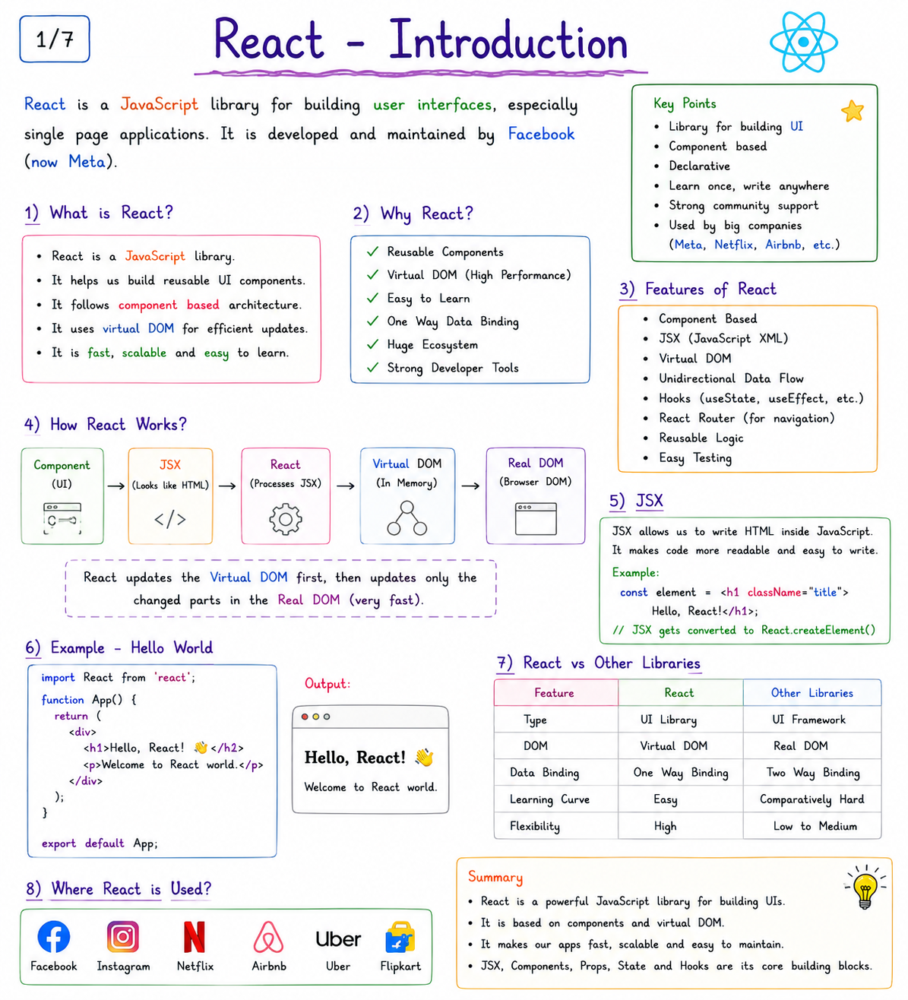
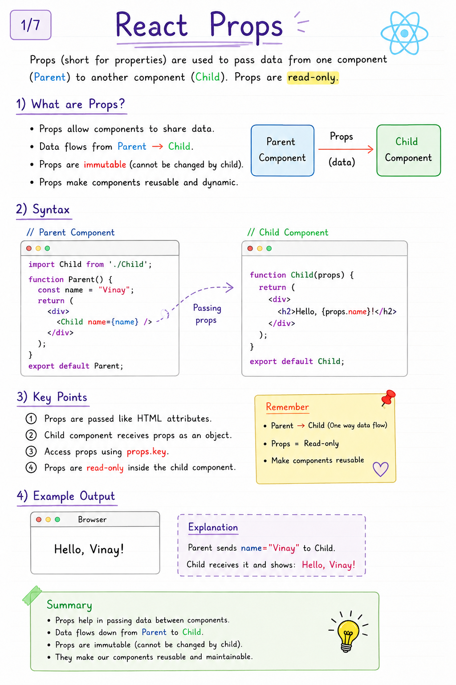
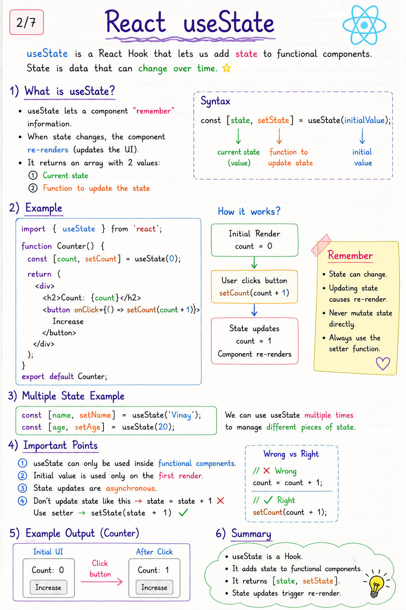
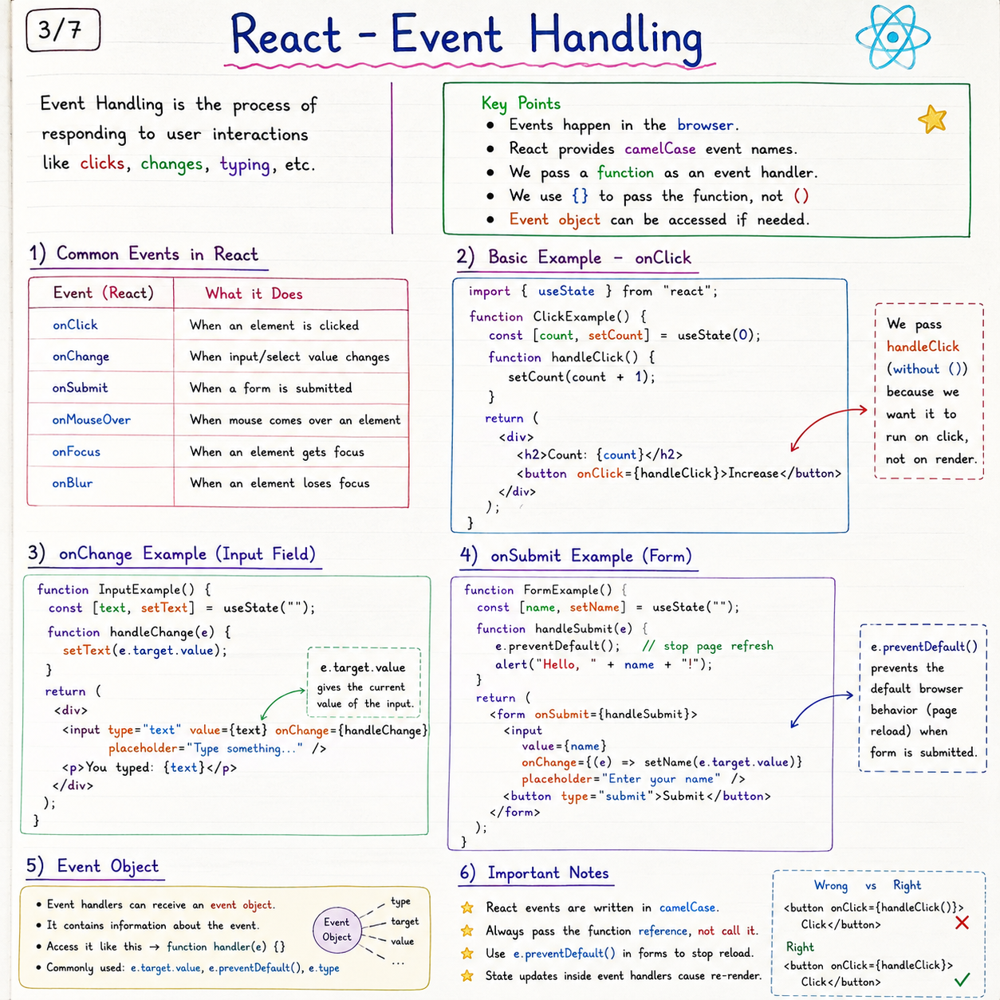
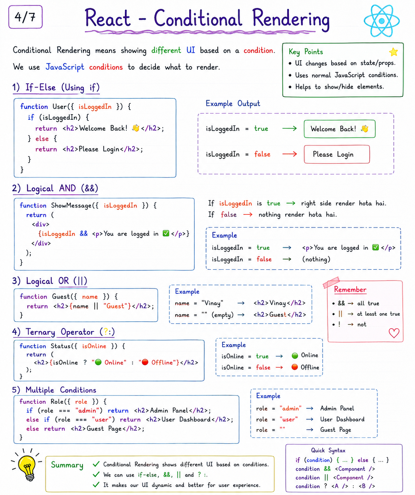
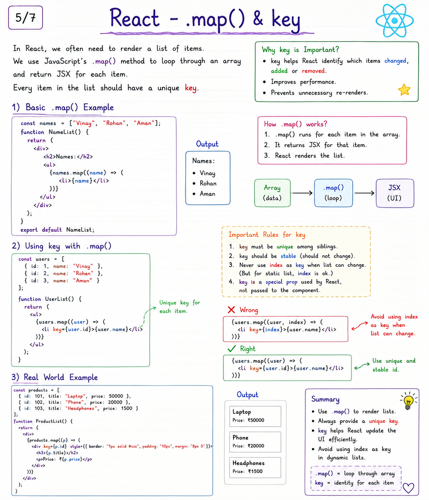
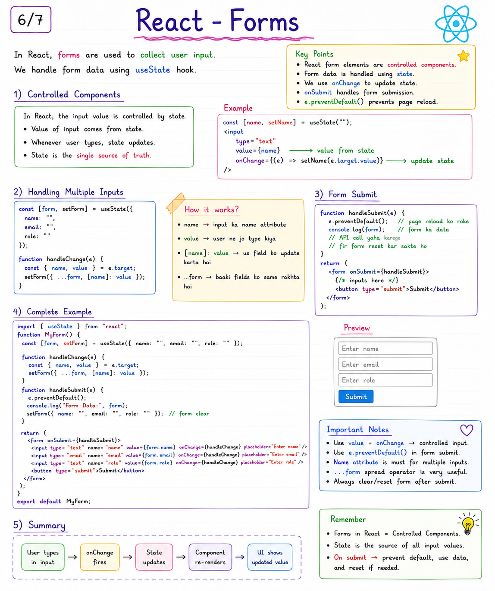

# React Learning Notes ⚛️

My React learning notes — concepts explained with examples.

---

## 📚 React Notes

### 01. React Introduction

---

### 02. Props

---

### 03. useState

---

### 04. Event Handling

---

### 05. Conditional Rendering

---

### 06. map() & key

---

### 07. Forms

