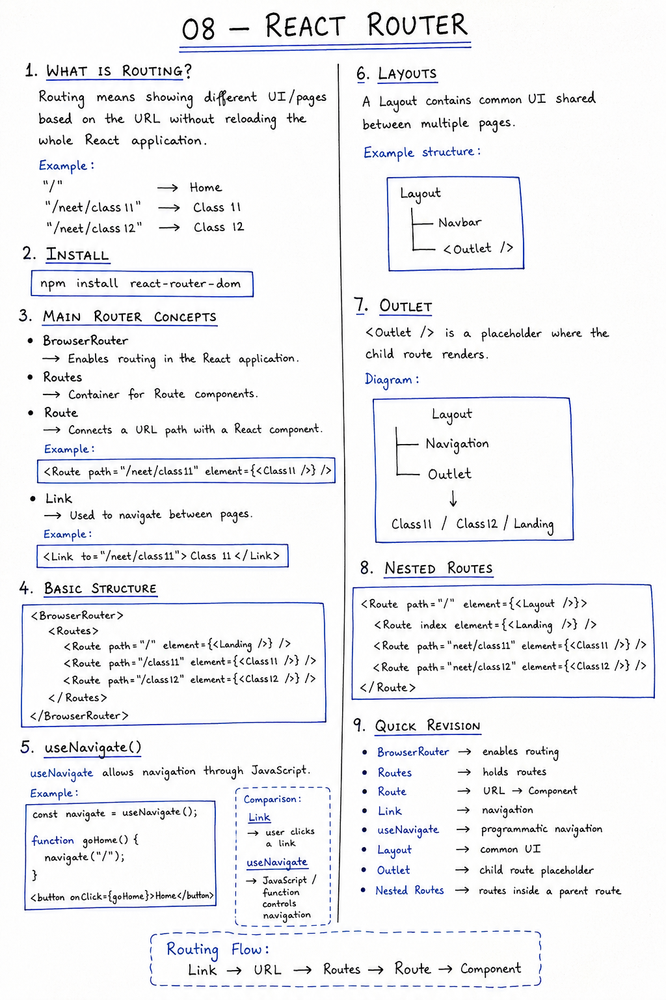
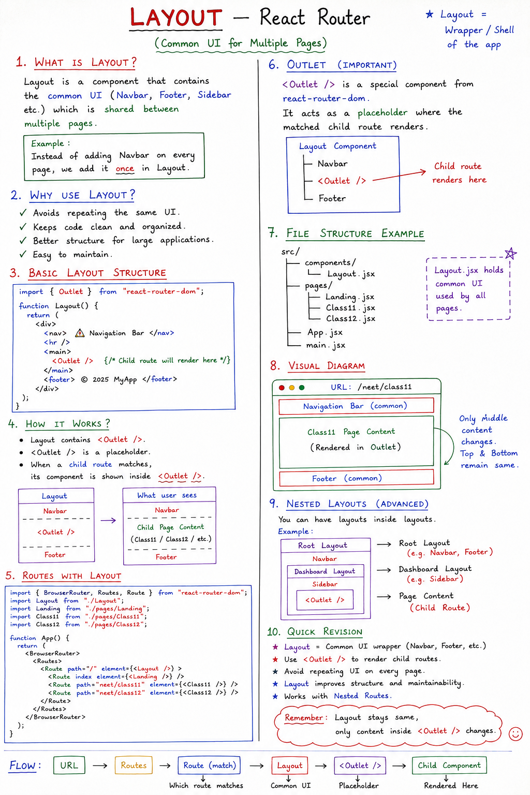
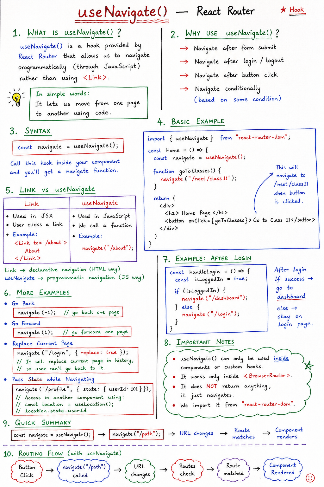
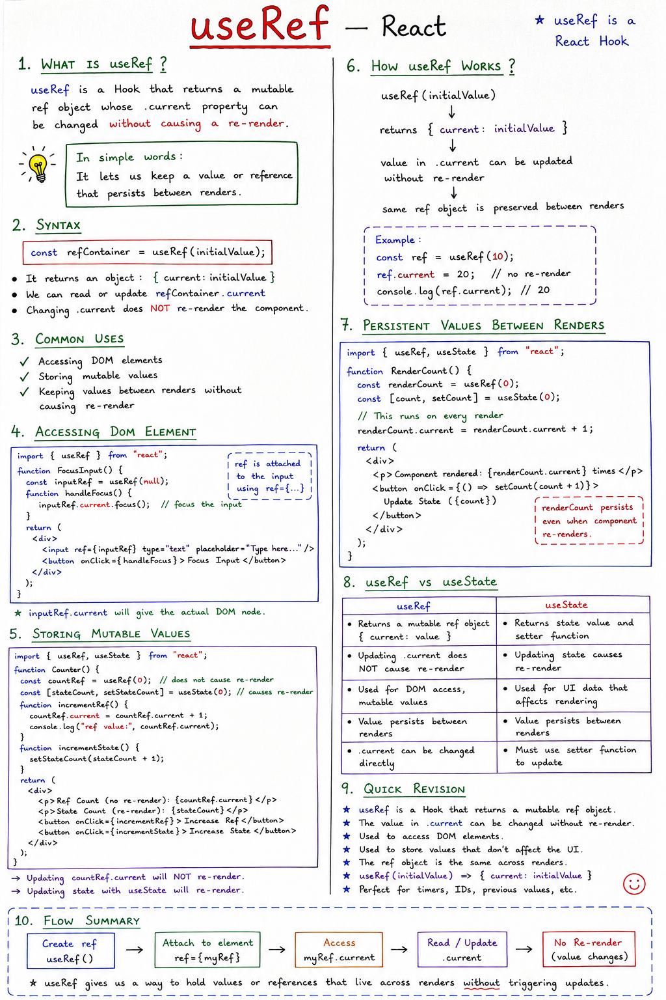
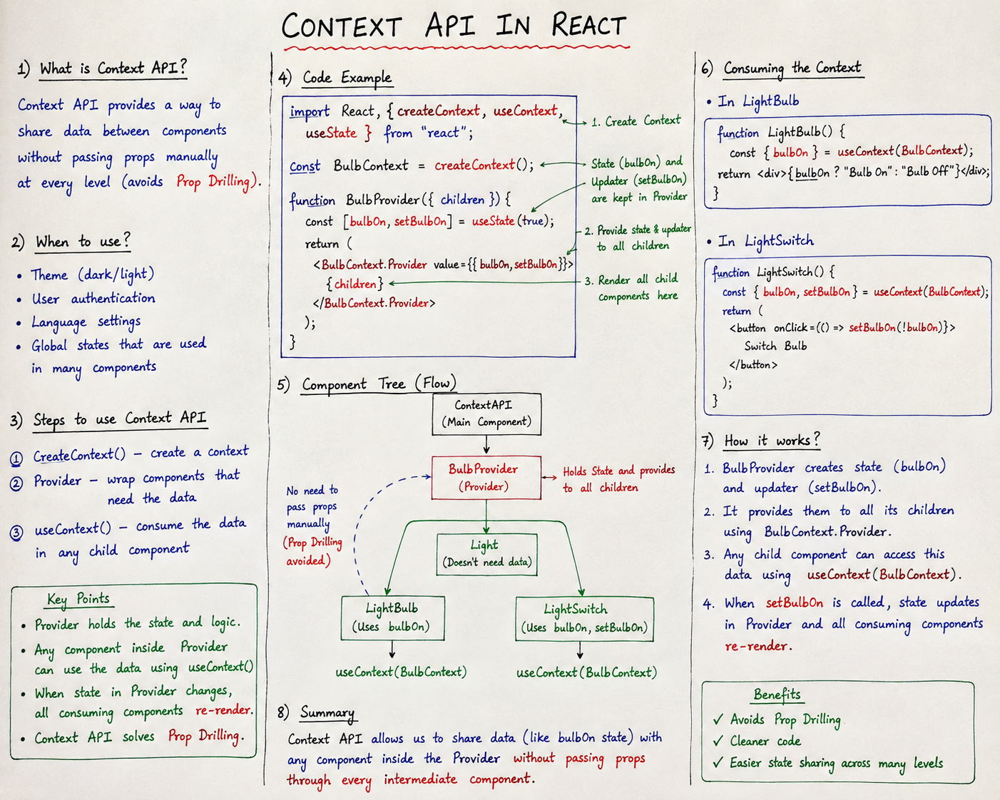
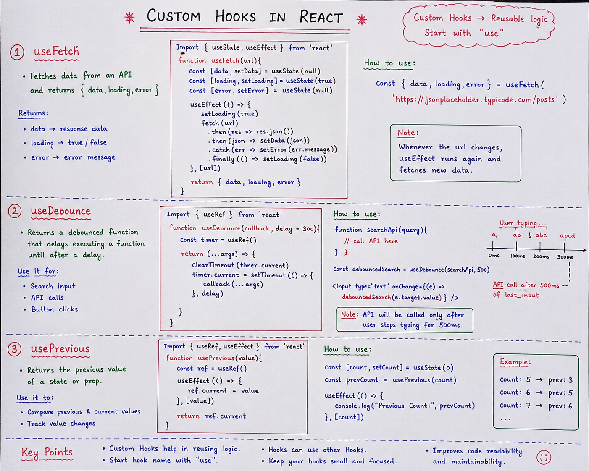

# React Learning Notes ⚛️

My React learning notes — concepts explained with examples.

---

## 📚 React Notes

### 01. Router

---

### 02. Props

---

### 03. useState

---

### 04. Event Handling

---

### 05. Context API

---

### 06. Context API

